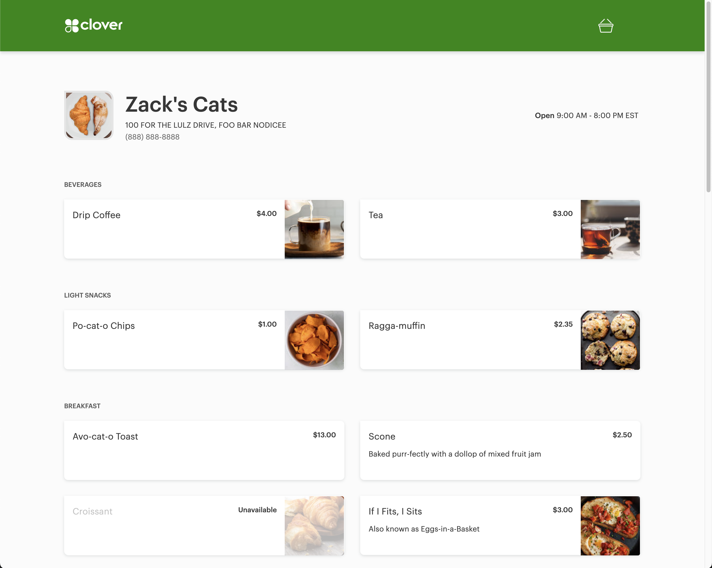
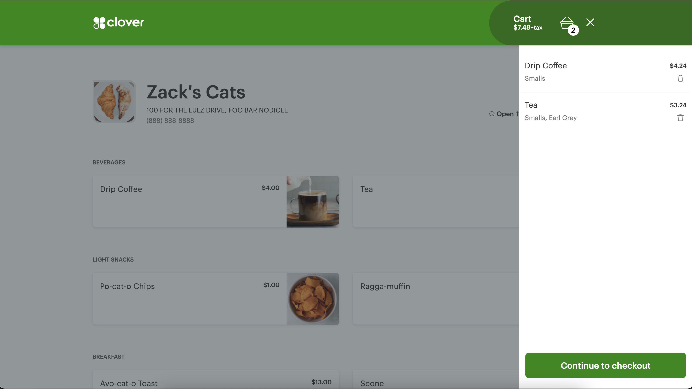

# webdev-coding-segment

For this project you will be creating a Clover Online Ordering experience with dynamic Merchant Info and Menu Data.
From the UI the user should be able to click items to add them to a shopping cart, view the cart as a slide-out panel and 
proceed to checkout.

All data should be fetched dynamically from the following endpoints:

- Merchant Data:  https://dev1.dev.clover.com/oloservice/v1/merchants/R9AHC6Q4K7PX1
- Menu Data: https://dev1.dev.clover.com/oloservice/v1/merchants/R9AHC6Q4K7PX1/menu

This project is intended to be written in pure vanilla javascript.

## UI Mock - Menu

## UI Mock - Shopping Cart

### Bonus Problems

1. **Allow multiple quantities in the cart.** For example, if a user clicks add to cart for a banana 3 times. The cart should show the banana with a quantity of 3, instead of showing the banana 3 times.
2. **Animations and transitions.** Make the cart slide in and out of the screen when the user clicks the cart icon. Go wild with this one and explore different animations and transitions on the whole page.
3. **Add a checkout button to the cart.** When the user clicks the checkout button, show a form that collects the user's name, email, and phone number. When the user clicks submit, show a success message and clear the cart.